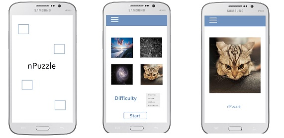

#nPuzzle - Native Apps Android 

An app development project at the University of Amsterdam, 2014, by Marcella Wijngaarden. The goal is to create an tile puzzle android app.

###Features

- Three levels of difficulty: “easy”, “medium”, and “hard”. 3x3, 4x4, 5x5 grid respectively. The default difficulty is “medium”.
- The user can select a puzzle image out of four images presented in the setup.
- Upon starting the game, the solution image is shown for 4 seconds.
- The puzzle is displayed as large as possible without distorting it's aspect ratio. The last tile of the puzzle is the blanc tile.
- The puzzle is displayed with noticeable borders around the tiles.
- The puzzle tiles are shuffled in a solvable way.
- Only tiles adjacent to the blanc tiles can be swapped with the blanc tile.
- If the player clicks a valid tile, see point above, the tile is swapped with the blanc tile. Other tile clicks are ignored.
- Only during gameplay a menu is available in which the user can reset the puzzle, change the difficulty, quit the current game, and see the solution.
- The user's preference for difficulty level is saved and is the default value next time starting the setup.
- If the user quits the app the game's state is saved and upon opening again the app will resume the game (and show the solution first for 3 seconds).
- If the user solves the puzzle a new activity appears congratulating the user, displaying the original image and listing the number of moves they used while solving it. Also there is a back button that returns the user to the setup screen.

### Design sketches

### API's and frameworks

- android.widget: for the use of Buttons, TextViews, Imageviews, Layouts etc.
- android.view: necessary library to make use of any views (see above)
- android.content: to switch between activities
- handlers: to delay codes